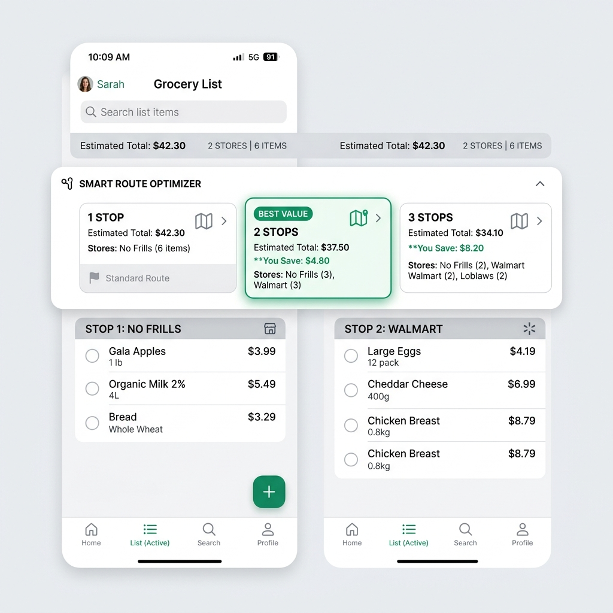
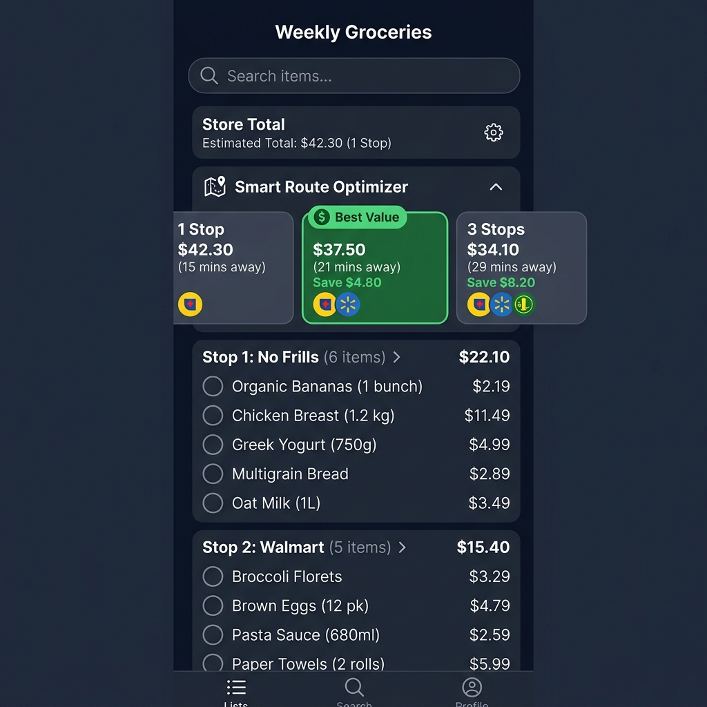
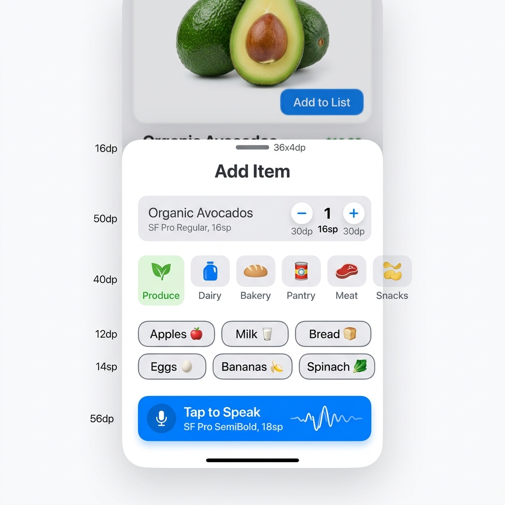
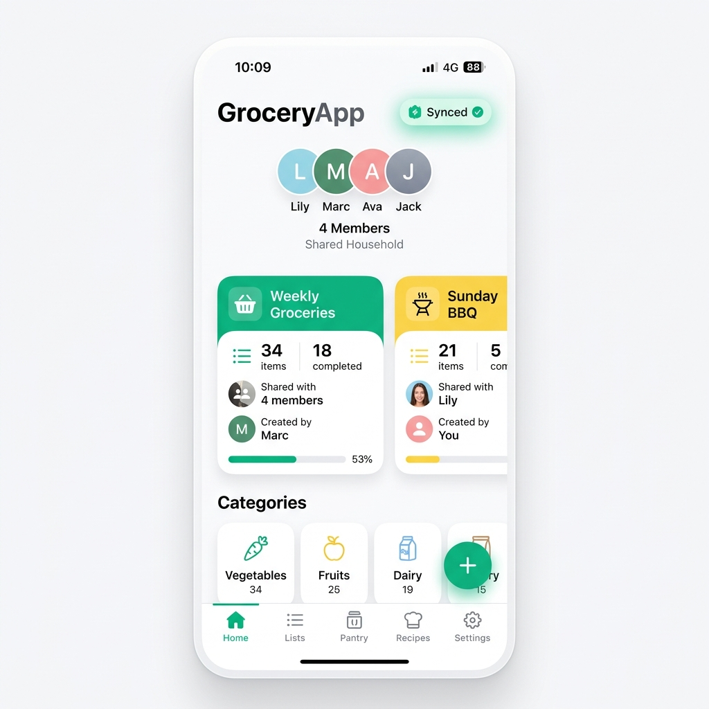

# PantryRun 🛒

PantryRun (package `com.shiftlogichq.pantryrun`, source directory `GroceryApp/`) is a
collaborative co-shopping application built with **React Native (Expo)**.
v1.31.0 / versionCode 31 (`GroceryApp/app.json` → `expo.version` and
`expo.android.versionCode`, matching `versionName` / `versionCode` in
`GroceryApp/android/app/build.gradle`) is live in **Play closed testing**; the iOS target
builds from the same source but has not shipped to the App Store yet.

The app features real-time peer synchronization, offline-first local state storage (Yjs CRDTs),
end-to-end encrypted list content, **opt-in** grocery price lookup (disabled until you turn it
on — see [Where prices come from](#-where-prices-come-from)), and a multi-stop route optimizer
(a paid **PantryRun Plus** feature) to maximize shopping savings.

---

## ✨ Features

### 🎨 Visual Design & Dark Mode
- Soft rounded cards, subtle shadows, and clean border separations.
- **Dynamic Theming**: Segmented theme controls inside the Settings page supporting **Light Mode**, **Dark Mode**, and **System Default** auto-toggling.
- Green primary branding for checkboxes, primary buttons, and cheapest-price markers — a leaf green with an amber accent in light mode, a mintier green with a golden accent in dark mode. The palette lives in `GroceryApp/src/components/groceryTheme.ts` (`theme.primary` and friends); a handful of price and scanner components still hardcode their own green rather than reading the token.

### 🗺️ Multi-Stop Route Optimizer ("Smart Splits") — requires PantryRun Plus
- **Paid feature.** The optimizer renders only for families with an active PantryRun Plus entitlement; everyone else sees an upsell in its place.
- It also needs price data to compare anything, and pricing is opt-in and empty by default (see below) — so a Plus subscriber who has not enabled pricing still gets no savings estimates.
- Computes greedy multi-stop shopping routes to get the best pricing across local grocery stores.
- Displays horizontal **Route Proposal Cards** (e.g. 1 Stop, 2 Stops, 3 Stops) with estimated subtotals, store listings, and highlighted savings.
- Highlights the optimal compromise proposal with a **Best Value** label.
- **Dynamic List Splits**: Tapping any route proposal splits the shopping list into stop-by-stop visit segments (e.g., `Stop 1: No Frills`, `Stop 2: Walmart`) displaying live stop subtotals and showing the best price per item for that store.

### 💲 Where prices come from
- **A stock build shows no prices at all — pricing is opt-in.** A master privacy gate in
  `PriceRegistry` (`GroceryApp/src/pricing/registry.ts`, `isPricingOptedIn`) makes both lookup
  entry points, `getPrice()` and `getAllPrices()`, return nothing until you enable pricing in
  Settings; `DEFAULT_SETTINGS` ships `pricingOptedIn: false` (and `priceServiceEnabled: false`,
  `contributeEnabled: false`) in `GroceryApp/src/config/settings.ts`. Every price read in the app
  routes through that registry (`GroceryApp/src/pricing/price-store.ts`), so the gate is not
  bypassable from a screen.
- **Once you have opted in**, the sources that can actually return data are the **crowdsourced
  price pool** (contributions are anonymised with RFC 9474 blind-RSA tokens) and **on-device flyer
  scanning** (`flyerScanEnabled`, default true).
- **Relay-assisted flyer extraction is a separate, additional switch and is off by default**
  (`cloudFlyerEnabled: false`; see `isAvailable()` in `GroceryApp/src/pricing/cloud-flyer.ts`).
  This is the one path that sends an image to your relay in plaintext — see below.
- The Instacart adapter requires an API key you supply, and the web-scraping adapter is opt-in and
  self-host only. Both are off by default.
- The Turso-backed deal/price adapters ship with **no credential path in v1** and therefore return no results — see `GroceryApp/docs/STORE_COMPLIANCE.md`.

### ➕ Add Item Sheet
- Clean form inputs for custom grocery additions.
- Interactive **Quantity Micro-Selectors** (`-` / `+` buttons) to easily adjust quantities.
- Categorized horizontal scroll tabs (Produce, Dairy, Meat, Bakery, etc.) and quick-add grids of commonly purchased items.
- **Voice-text parsing (NLP)**: a Voice Input button opens a text prompt (iOS `Alert.prompt`, where you can use the keyboard's own dictation key; a text modal on Android) and parses what you enter — e.g. *"add two bags of apples"* → name, quantity, unit. The app does **not** record audio or do its own speech recognition.

### 🔄 Local-First Real-Time Sync
- Uses **Yjs CRDTs** for instant local-first data mutations.
- Syncs in the background over a WebSocket to a relay you run yourself (see `relay-server/`). The default relay URL is `ws://localhost`, so a LAN self-host setup is plain `ws://` — use `wss://` for anything off your own network. List updates are encrypted end-to-end regardless of the transport.
- The app works fully offline and queues updates until the relay is reachable.
- Header badge showing sync state (Syncing / Synced / Offline / Local only) and the last-synced time.

---

## 🔐 What the relay can and cannot see

List content is end-to-end encrypted with XChaCha20-Poly1305 under a family key the relay never
holds, so the relay cannot read item names, quantities, notes, or prices. It is **not** a
zero-knowledge service in the metadata sense — be precise about the difference:

**The relay does see:**
- Family, list, and device identifiers (opaque, but stable and linkable across sessions), plus enrollment/membership state — it needs these to route updates.
- Connection timing, update sizes, and which devices are online together.
- The relay **persists** ciphertext updates and enrollment state to disk so offline devices can catch up (aged out after `UPDATE_TTL_MS`, default 30 days). It is not purely ephemeral.
- If you enable the optional flyer-scan upload, the **flyer image itself** is sent to the relay's extract endpoint without end-to-end encryption — the relay reads that image. It is protected in transit only if you point the app at a `wss://` relay; the shipped default is `ws://localhost` (`GroceryApp/src/config/settings.ts:32`), which has no TLS at all.

**The relay cannot see:** item names, quantities, notes, categories, prices, or your family
passphrase — those exist only as ciphertext outside your own devices.

Full analysis, including known limitations (no forward secrecy, no group key rotation), is in
[`GroceryApp/docs/threat-model.md`](GroceryApp/docs/threat-model.md) and
[`SECURITY.md`](SECURITY.md).

---

## 📸 Screenshots

### 1. Home Dashboard & Shared Shopping List (Light Mode)
Collaborative list dashboard with progress indicators and the **Smart Route Optimizer** displaying optimal multi-stop splits:


### 2. Shopping List & Split Routing (Dark Mode)
Dark interface showing a route proposal selected, splitting list items into Stop-specific groups:


### 3. Add Item Bottom Sheet *(design mockup, not a device capture)*
Add sheet with category tabs, quick chips, and quantity selectors:


### 4. Personal Dashboard *(design mockup, not a device capture)*
Overview of lists, syncing devices, and active collaboration metrics:


---

## 🛠️ Technology Stack

- **Framework**: React Native 0.85 with Expo SDK 56 (`expo ~56.0.6`)
- **Real-Time Sync**: Yjs (CRDTs) over `y-websocket`, with a Node relay in `relay-server/`
- **Crypto**: `react-native-libsodium` (XChaCha20-Poly1305, Argon2id, Ed25519) and `@cloudflare/blindrsa-ts`
- **Local Storage**: WatermelonDB & Expo Secure Store
- **State Management**: Zustand
- **Language**: TypeScript
- **Styling**: Vanilla React Native Stylesheets

---

## 🚀 Getting Started

### Prerequisites
- Node.js — CI builds on Node 22 (see the `node-version` inputs in `.github/workflows/ci.yml`); no global Expo CLI needed, the project uses `npx expo` / the React Native CLI
- iOS Simulator (macOS Xcode) or Android Emulator (Android Studio)

### Installation
1. Clone the repository and navigate to the client directory:
   ```bash
   git clone https://github.com/arshad1416/pantryrun.git
   cd pantryrun/GroceryApp
   ```
2. Install dependencies:
   ```bash
   npm install
   ```
3. Start the Metro bundler:
   ```bash
   npm start
   ```
   Or launch directly on simulators:
   ```bash
   npm run ios     # expo run:ios
   npm run android # react-native run-android
   ```

### Sync relay (optional but required for multi-device sync)
The app is fully usable offline and single-device without a relay ("Local only"). To sync a
family across devices, run your own relay from `relay-server/` (see `docker-compose.yml` at the
repository root and `GroceryApp/docs/self-host-security.md`) and point the app at it in
Settings. The managed relay tier is hidden in v1 (`GroceryApp/docs/STORE_COMPLIANCE.md`), so
self-hosting is the only sync path.
